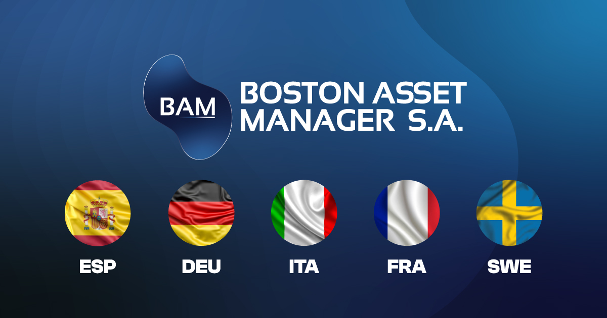

<div align="center">

# 🏛️ Boston Asset Manager Europa

### Plataforma de inversiones multi-idioma para el mercado europeo

[](https://nextjs.org/)
[](https://www.typescriptlang.org/)
[](https://tailwindcss.com/)
[](https://bostonam.eu)

<br />



</div>

---

## 📋 Descripción

**Boston Asset Manager Europa** es una landing page corporativa de alto rendimiento para una firma de gestión de activos. El sitio ofrece una experiencia premium con animaciones fluidas, videos de fondo optimizados y soporte multi-idioma automático basado en dominio.

### ✨ Características principales

- 🌍 **Multi-dominio**: Un solo codebase sirve 12+ dominios europeos
- 🌐 **i18n automático**: Detección de idioma por dominio (`.de`, `.es`, `.fr`, `.it`, `.se`)
- 🎬 **Videos optimizados**: Precarga inteligente y lazy loading
- ⚡ **Alto rendimiento**: Optimizado para Core Web Vitals
- 📱 **Responsive**: Diseño adaptativo para todos los dispositivos
- 🎨 **Animaciones premium**: GSAP + Framer Motion

---

## 🌐 Dominios

El proyecto soporta múltiples dominios con detección automática de idioma:

| Dominio | Idioma | Tipo |
|---------|--------|------|
| `bostonam.eu` | Selector | 🏠 Principal |
| `bostonassetmanager.eu` | Selector | 🏠 Principal |
| `bostonam.de` | Alemán | 🇩🇪 |
| `bostonam.es` | Español | 🇪🇸 |
| `bostonam.fr` | Francés | 🇫🇷 |
| `bostonam.it` | Italiano | 🇮🇹 |
| `bostonam.se` | Sueco | 🇸🇪 |

> Los dominios `.eu` muestran un selector de país, mientras que los dominios específicos cargan directamente en su idioma.

---

## 🛠️ Tech Stack

<table>
<tr>
<td align="center" width="96">

<br>Next.js 15
</td>
<td align="center" width="96">

<br>TypeScript
</td>
<td align="center" width="96">

<br>Tailwind CSS
</td>
<td align="center" width="96">

<br>Vercel
</td>
</tr>
</table>

### Dependencias principales

| Categoría | Tecnología |
|-----------|------------|
| **Framework** | Next.js 15 (App Router) |
| **Lenguaje** | TypeScript 5 |
| **Estilos** | Tailwind CSS + shadcn/ui |
| **Animaciones** | Framer Motion + GSAP |
| **i18n** | react-i18next |
| **UI Components** | Radix UI |
| **Forms** | React Hook Form + Zod |
| **Analytics** | Vercel Analytics |

---

## 🚀 Instalación

```bash
# Clonar repositorio
git clone https://github.com/6h0T/boston-europa.git

# Instalar dependencias
npm install

# Iniciar servidor de desarrollo
npm run dev

# Build de producción
npm run build
```

---

## 📁 Estructura del proyecto

```
boston-europa/
├── app/                    # App Router (páginas)
│   ├── page.tsx           # Home
│   ├── contacto/          # Página de contacto
│   ├── inversiones/       # Página de inversiones
│   ├── laempresa/         # Sobre nosotros
│   └── abrircuenta/       # Abrir cuenta
├── components/
│   ├── sections/          # Secciones de página
│   ├── ui/                # Componentes reutilizables
│   └── providers/         # Context providers
├── hooks/                 # Custom hooks
├── lib/                   # Utilidades
├── locales/               # Traducciones (es, en, de, fr, it, sv)
├── public/                # Assets estáticos
└── middleware.ts          # Detección de dominio/idioma
```

---

## 📜 Scripts disponibles

| Comando | Descripción |
|---------|-------------|
| `npm run dev` | Servidor de desarrollo |
| `npm run build` | Build de producción |
| `npm run start` | Iniciar producción |
| `npm run lint` | Ejecutar ESLint |
| `npm run analyze` | Analizar rendimiento |

---

## 📄 Licencia

Proyecto privado - Todos los derechos reservados © Boston Asset Manager

---

<div align="center">

**[bostonam.eu](https://bostonam.eu)** · Desarrollado por g. para © Boston Asset Manager

</div>
